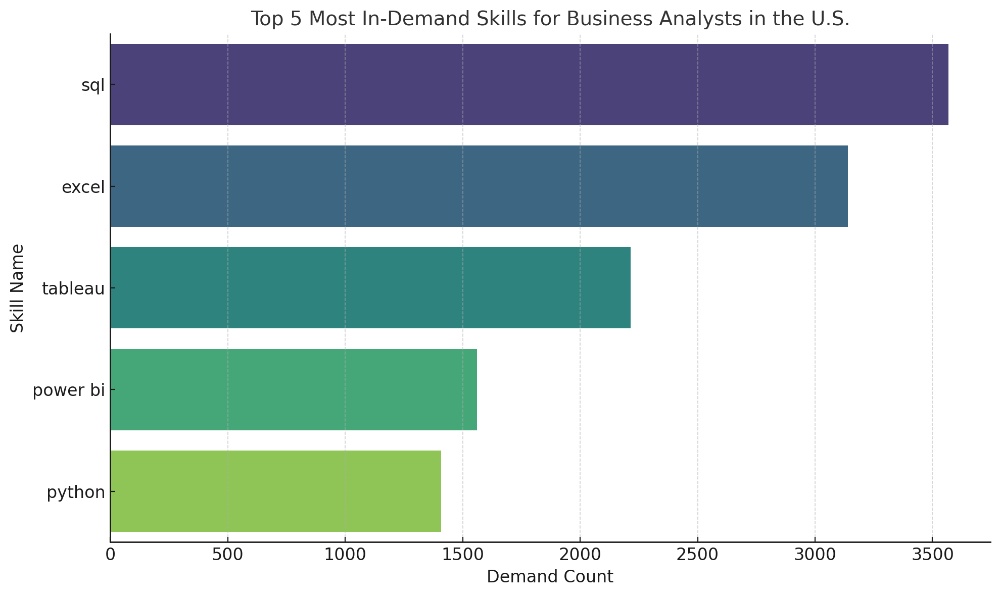
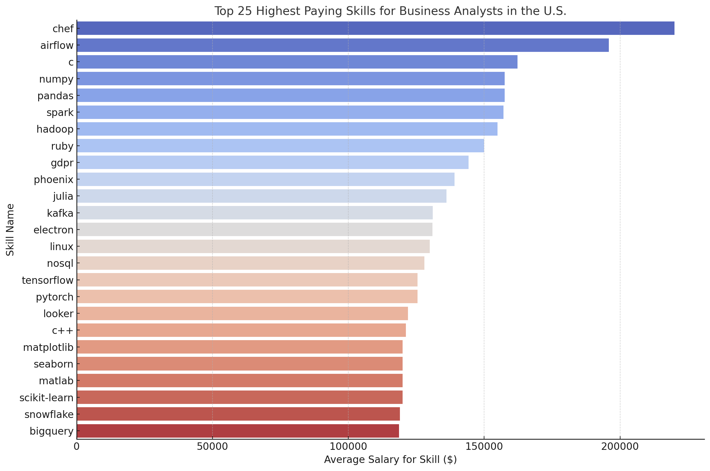
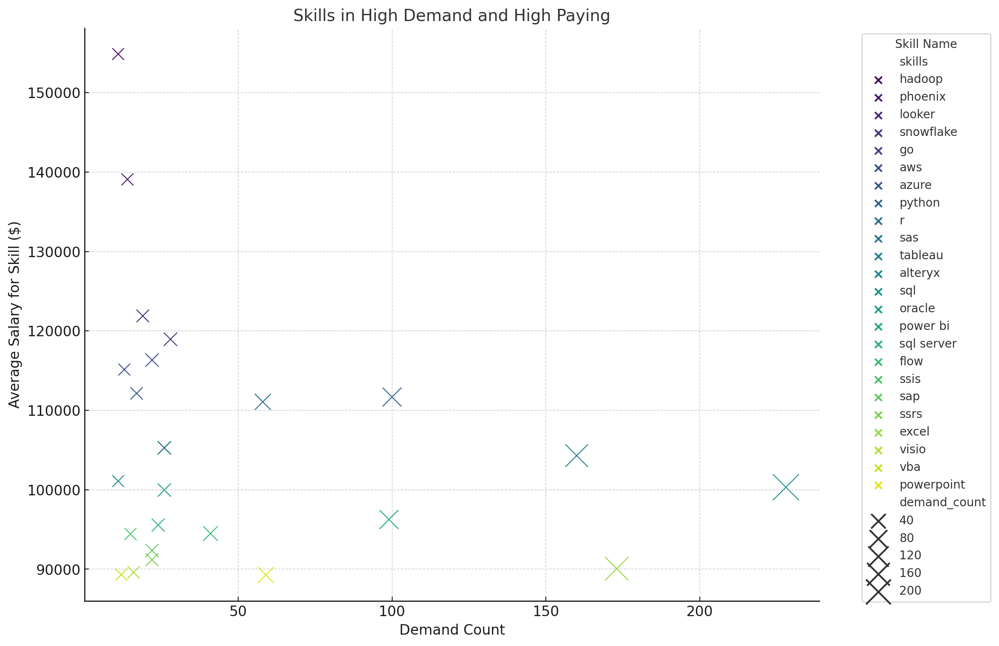

# Introduction

Welcome to my capstone project on the data job market, with a special focus on Business Analyst roles in the United States. This study dives into the highest paying positions, essential skills in demand, and the intersections of high demand and high salary within the field of data analytics. 

For insights derived directly from SQL queries, explore them [here](/project_queries/).

# Background

This project was initiated to enhance understanding of the business analyst job landscape, aiming to identify the most lucrative roles and the skills needed to secure them.

### The following is the list of questions i am answering:

1. Which data analyst jobs offer the highest salaries?
2. What qualifications are essential for these high-paying positions?
3. Which skills are currently most in-demand in the data analyst field?
4. Are there particular skills that correlate with higher salaries?
5. What are the most beneficial skills to acquire for career advancement?

# Tools Employed

For an in-depth exploration of the data analyst job market, I employed a comprehensive set of tools:

- **PostgreSQL**
- **Visual Studio Code**
- **Git & GitHub**

# The Analysis

### Overview
Our comprehensive analysis of the business analyst job market in the United States reveals key insights into the highest paying roles, most in-demand skills, and the valuable intersection of demand and salary. Here's a concise summary of our findings:

### Top Paying Roles

- The top-paying business analyst roles are concentrated in companies like Roblox, Noom, and Uber. Positions like Principal Economist/Scientist and Lead Business Intelligence Engineer offer salaries that significantly exceed the average, highlighting the premium on advanced analytical and economic modeling skills.

```sql
SELECT
    job_id,
    company_dim.name as company_name,
    job_title,
    job_location,
    job_schedule_type,
    salary_year_avg,
    job_posted_date
FROM
    job_postings_fact
LEFT JOIN
    company_dim on job_postings_fact.company_id = company_dim.company_id
WHERE
    job_title_short = 'Business Analyst'
    and job_country = 'United States'
    and salary_year_avg is not NULL
ORDER BY
    salary_year_avg DESC
LIMIT
    10;
```

### Skills for High-Paying Jobs

- Essential skills for these lucrative positions include SQL, Python, R, and Go. The demand for technical proficiency in data manipulation, programming, and statistical analysis is evident, emphasizing the importance of continuous skill development in these areas.

```sql
WITH top_paying_jobs as (
    SELECT
        job_id,
        company_dim.name as company_name,
        job_title,
        salary_year_avg
    FROM
        job_postings_fact
    LEFT JOIN
        company_dim on job_postings_fact.company_id = company_dim.company_id
    WHERE
        job_title_short = 'Business Analyst'
        and job_country = 'United States'
        and salary_year_avg is not NULL
    ORDER BY
        salary_year_avg DESC
    LIMIT
        10
)

SELECT
    top_paying_jobs.*,
    skills_dim.skills as skill_name
FROM 
    top_paying_jobs
INNER JOIN skills_job_dim on top_paying_jobs.job_id = skills_job_dim.job_id
INNER JOIN skills_dim on skills_job_dim.skill_id = skills_dim.skill_id
ORDER BY
    salary_year_avg DESC;
```

### Most In-Demand Skills

- SQL and Excel dominate as the most in-demand skills, followed closely by Tableau, Power BI, and Python. This suggests a strong market preference for professionals proficient in data querying, spreadsheet management, and data visualization


*The bar plot above illustrates the top five most in-demand skills for business analysts in the U.S. It clearly shows that SQL leads in demand, followed by Excel, Tableau, Power BI, and Python. These skills are essential for data manipulation, analysis, and visualization, which are critical in the business analyst field. ChatGPT generated visuals from sql queries in this project.*

### Top Paying Skills
- Specialized skills like Chef and Airflow command the highest salaries, reflecting the growing need for business analysts capable of managing complex data workflows and automation tasks. Traditional programming skills such as C also remain highly valued.

*The visualization above highlights the top 25 highest paying skills for business analysts in the U.S., demonstrating the lucrative potential of skills such as Chef, Airflow, and traditional programming languages like C. This indicates a premium on both technical proficiency and niche skills within the business analyst domain. ChatGPT generated visuals from sql queries in this project.*

### High Demand, High Paying Skills
- Skills like Hadoop, Phoenix, and Looker are not only in high demand but also associated with higher salaries. These skills are particularly valuable, offering significant leverage for career advancement within the business analysis field.

*The scatter plot above shows the relationship between demand count and average salary for skills that are both in high demand and command high salaries. This visualization helps identify strategic skills such as Hadoop, Phoenix, Looker, and Snowflake, which are crucial for advancing in the business analyst career due to their combination of high demand and high pay. ChatGPT generated visuals from sql queries in this project.*

# Conclusion

This capstone project has illuminated key trends in the U.S. business analyst job market, identifying lucrative roles, essential skills, and the value of combining high demand with high salaries. Key takeaways include:

1. **Core Skills**: Mastery of **SQL** and **Excel** is fundamental, while advanced skills in **Python** and **R** enhance salary potential.
2. **Specialized Knowledge**: Tools like **Chef** and **Airflow**, which cater to complex data workflows, command premium salaries.
3. **Strategic Skills**: Proficiency in **Hadoop**, **Phoenix**, and **Looker** is highly advantageous, linking high demand to high pay.

This analysis provides a clear direction for business analysts aiming to elevate their careers by focusing on skills that maximize both marketability and earning potential.

